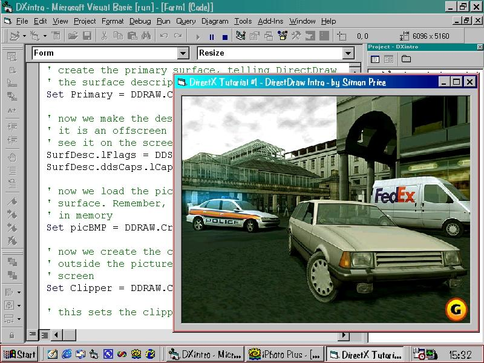



## An Introduction To DirectX

### Description

This is a tutorial for a complete beginner to DirectX. This introduction shows you the very basics of using DirectDraw, with more comments than code to help explain everything in plain English. The resulting program will draw a picture and stretch it to fit the size of the form. IMPORTANT - This requires DirectX7 and the DirectX7 for Visual Basic Type Library. If this tutorial helps you, please give feedback and/or vote, because if there is enough interest, subsequent tutorials will follow.
 
### More Info
 

             |
---                |---
**Submitted On**   |2000-09-23 16:01:46
**By**             |[Simon Price](https://github.com/Planet-Source-Code/PSCIndex/blob/master/ByAuthor/simon-price.md)
**Level**          |Intermediate
**User Rating**    |5.0 (5 globes from 1 user)
**Compatibility**  |VB 6\.0
**Category**       |[DirectX](https://github.com/Planet-Source-Code/PSCIndex/blob/master/ByCategory/directx__1-44.md)
**World**          |[Visual Basic](https://github.com/Planet-Source-Code/PSCIndex/blob/master/ByWorld/visual-basic.md)
**Archive File**   |[CODE\_UPLOAD100999232000\.zip](https://github.com/Planet-Source-Code/simon-price-an-introduction-to-directx__1-11635/archive/master.zip)

